Predicting house sales prices (Ames housing dataset)
================
Marc Feldmann
2022-09-19

In this markdown document, data from the Ames housing dataset
(<https://www.kaggle.com/datasets/prevek18/ames-housing-dataset>) will
be used to compare the performance of four models in the prediction of
housing prices in Ames, IA from 2006 to 2010. The compared models are:

-   linear regression
-   LASSO regression
-   regression tree
-   artificial neural network

The following packages will be used:

``` r
library(readxl)
library(visdat)
library(corrplot)
library(imputeTS)
library(olsrr)
library(car)
library(glmnet)
library(ISLR)
library(tree)
library(neuralnet)
```

<br>

## Table of contents

1.  Exploratory Data Analysis (EDA)
2.  Data Preprocessing
3.  Dataset Split into Training and Test Subsets
4.  Model Training and Comparison

-   4.1. linear regression
-   4.2. LASSO regression
-   4.3. regression tree
-   4.4. artificial neural network

5.  Model Recommendation

<br>

## 1. Exploratory Data Analysis (EDA)

To support further analysis, we will first generate some basic
descriptive statistics.

We first load the dataset and explore its overall structure:

``` r
data = read_excel("C:\\Users\\marc.feldmann\\Documents\\data_science_local\\HousePricePrediction\\data\\Ames housing dataset.xls")
str(data)
```

    ## tibble [2,930 × 82] (S3: tbl_df/tbl/data.frame)
    ##  $ Order          : num [1:2930] 1 2 3 4 5 6 7 8 9 10 ...
    ##  $ PID            : chr [1:2930] "0526301100" "0526350040" "0526351010" "0526353030" ...
    ##  $ MS SubClass    : chr [1:2930] "020" "020" "020" "020" ...
    ##  $ MS Zoning      : chr [1:2930] "RL" "RH" "RL" "RL" ...
    ##  $ Lot Frontage   : num [1:2930] 141 80 81 93 74 78 41 43 39 60 ...
    ##  $ Lot Area       : num [1:2930] 31770 11622 14267 11160 13830 ...
    ##  $ Street         : chr [1:2930] "Pave" "Pave" "Pave" "Pave" ...
    ##  $ Alley          : chr [1:2930] "NA" "NA" "NA" "NA" ...
    ##  $ Lot Shape      : chr [1:2930] "IR1" "Reg" "IR1" "Reg" ...
    ##  $ Land Contour   : chr [1:2930] "Lvl" "Lvl" "Lvl" "Lvl" ...
    ##  $ Utilities      : chr [1:2930] "AllPub" "AllPub" "AllPub" "AllPub" ...
    ##  $ Lot Config     : chr [1:2930] "Corner" "Inside" "Corner" "Corner" ...
    ##  $ Land Slope     : chr [1:2930] "Gtl" "Gtl" "Gtl" "Gtl" ...
    ##  $ Neighborhood   : chr [1:2930] "NAmes" "NAmes" "NAmes" "NAmes" ...
    ##  $ Condition 1    : chr [1:2930] "Norm" "Feedr" "Norm" "Norm" ...
    ##  $ Condition 2    : chr [1:2930] "Norm" "Norm" "Norm" "Norm" ...
    ##  $ Bldg Type      : chr [1:2930] "1Fam" "1Fam" "1Fam" "1Fam" ...
    ##  $ House Style    : chr [1:2930] "1Story" "1Story" "1Story" "1Story" ...
    ##  $ Overall Qual   : num [1:2930] 6 5 6 7 5 6 8 8 8 7 ...
    ##  $ Overall Cond   : num [1:2930] 5 6 6 5 5 6 5 5 5 5 ...
    ##  $ Year Built     : num [1:2930] 1960 1961 1958 1968 1997 ...
    ##  $ Year Remod/Add : num [1:2930] 1960 1961 1958 1968 1998 ...
    ##  $ Roof Style     : chr [1:2930] "Hip" "Gable" "Hip" "Hip" ...
    ##  $ Roof Matl      : chr [1:2930] "CompShg" "CompShg" "CompShg" "CompShg" ...
    ##  $ Exterior 1st   : chr [1:2930] "BrkFace" "VinylSd" "Wd Sdng" "BrkFace" ...
    ##  $ Exterior 2nd   : chr [1:2930] "Plywood" "VinylSd" "Wd Sdng" "BrkFace" ...
    ##  $ Mas Vnr Type   : chr [1:2930] "Stone" "None" "BrkFace" "None" ...
    ##  $ Mas Vnr Area   : num [1:2930] 112 0 108 0 0 20 0 0 0 0 ...
    ##  $ Exter Qual     : chr [1:2930] "TA" "TA" "TA" "Gd" ...
    ##  $ Exter Cond     : chr [1:2930] "TA" "TA" "TA" "TA" ...
    ##  $ Foundation     : chr [1:2930] "CBlock" "CBlock" "CBlock" "CBlock" ...
    ##  $ Bsmt Qual      : chr [1:2930] "TA" "TA" "TA" "TA" ...
    ##  $ Bsmt Cond      : chr [1:2930] "Gd" "TA" "TA" "TA" ...
    ##  $ Bsmt Exposure  : chr [1:2930] "Gd" "No" "No" "No" ...
    ##  $ BsmtFin Type 1 : chr [1:2930] "BLQ" "Rec" "ALQ" "ALQ" ...
    ##  $ BsmtFin SF 1   : num [1:2930] 639 468 923 1065 791 ...
    ##  $ BsmtFin Type 2 : chr [1:2930] "Unf" "LwQ" "Unf" "Unf" ...
    ##  $ BsmtFin SF 2   : num [1:2930] 0 144 0 0 0 0 0 0 0 0 ...
    ##  $ Bsmt Unf SF    : num [1:2930] 441 270 406 1045 137 ...
    ##  $ Total Bsmt SF  : num [1:2930] 1080 882 1329 2110 928 ...
    ##  $ Heating        : chr [1:2930] "GasA" "GasA" "GasA" "GasA" ...
    ##  $ Heating QC     : chr [1:2930] "Fa" "TA" "TA" "Ex" ...
    ##  $ Central Air    : chr [1:2930] "Y" "Y" "Y" "Y" ...
    ##  $ Electrical     : chr [1:2930] "SBrkr" "SBrkr" "SBrkr" "SBrkr" ...
    ##  $ 1st Flr SF     : num [1:2930] 1656 896 1329 2110 928 ...
    ##  $ 2nd Flr SF     : num [1:2930] 0 0 0 0 701 678 0 0 0 776 ...
    ##  $ Low Qual Fin SF: num [1:2930] 0 0 0 0 0 0 0 0 0 0 ...
    ##  $ Gr Liv Area    : num [1:2930] 1656 896 1329 2110 1629 ...
    ##  $ Bsmt Full Bath : num [1:2930] 1 0 0 1 0 0 1 0 1 0 ...
    ##  $ Bsmt Half Bath : num [1:2930] 0 0 0 0 0 0 0 0 0 0 ...
    ##  $ Full Bath      : num [1:2930] 1 1 1 2 2 2 2 2 2 2 ...
    ##  $ Half Bath      : num [1:2930] 0 0 1 1 1 1 0 0 0 1 ...
    ##  $ Bedroom AbvGr  : num [1:2930] 3 2 3 3 3 3 2 2 2 3 ...
    ##  $ Kitchen AbvGr  : num [1:2930] 1 1 1 1 1 1 1 1 1 1 ...
    ##  $ Kitchen Qual   : chr [1:2930] "TA" "TA" "Gd" "Ex" ...
    ##  $ TotRms AbvGrd  : num [1:2930] 7 5 6 8 6 7 6 5 5 7 ...
    ##  $ Functional     : chr [1:2930] "Typ" "Typ" "Typ" "Typ" ...
    ##  $ Fireplaces     : num [1:2930] 2 0 0 2 1 1 0 0 1 1 ...
    ##  $ Fireplace Qu   : chr [1:2930] "Gd" "NA" "NA" "TA" ...
    ##  $ Garage Type    : chr [1:2930] "Attchd" "Attchd" "Attchd" "Attchd" ...
    ##  $ Garage Yr Blt  : num [1:2930] 1960 1961 1958 1968 1997 ...
    ##  $ Garage Finish  : chr [1:2930] "Fin" "Unf" "Unf" "Fin" ...
    ##  $ Garage Cars    : num [1:2930] 2 1 1 2 2 2 2 2 2 2 ...
    ##  $ Garage Area    : num [1:2930] 528 730 312 522 482 470 582 506 608 442 ...
    ##  $ Garage Qual    : chr [1:2930] "TA" "TA" "TA" "TA" ...
    ##  $ Garage Cond    : chr [1:2930] "TA" "TA" "TA" "TA" ...
    ##  $ Paved Drive    : chr [1:2930] "P" "Y" "Y" "Y" ...
    ##  $ Wood Deck SF   : num [1:2930] 210 140 393 0 212 360 0 0 237 140 ...
    ##  $ Open Porch SF  : num [1:2930] 62 0 36 0 34 36 0 82 152 60 ...
    ##  $ Enclosed Porch : num [1:2930] 0 0 0 0 0 0 170 0 0 0 ...
    ##  $ 3Ssn Porch     : num [1:2930] 0 0 0 0 0 0 0 0 0 0 ...
    ##  $ Screen Porch   : num [1:2930] 0 120 0 0 0 0 0 144 0 0 ...
    ##  $ Pool Area      : num [1:2930] 0 0 0 0 0 0 0 0 0 0 ...
    ##  $ Pool QC        : chr [1:2930] "NA" "NA" "NA" "NA" ...
    ##  $ Fence          : chr [1:2930] "NA" "MnPrv" "NA" "NA" ...
    ##  $ Misc Feature   : chr [1:2930] "NA" "NA" "Gar2" "NA" ...
    ##  $ Misc Val       : num [1:2930] 0 0 12500 0 0 0 0 0 0 0 ...
    ##  $ Mo Sold        : num [1:2930] 5 6 6 4 3 6 4 1 3 6 ...
    ##  $ Yr Sold        : num [1:2930] 2010 2010 2010 2010 2010 2010 2010 2010 2010 2010 ...
    ##  $ Sale Type      : chr [1:2930] "WD" "WD" "WD" "WD" ...
    ##  $ Sale Condition : chr [1:2930] "Normal" "Normal" "Normal" "Normal" ...
    ##  $ SalePrice      : num [1:2930] 215000 105000 172000 244000 189900 ...

``` r
summary(data)
```

    ##      Order            PID            MS SubClass         MS Zoning        
    ##  Min.   :   1.0   Length:2930        Length:2930        Length:2930       
    ##  1st Qu.: 733.2   Class :character   Class :character   Class :character  
    ##  Median :1465.5   Mode  :character   Mode  :character   Mode  :character  
    ##  Mean   :1465.5                                                           
    ##  3rd Qu.:2197.8                                                           
    ##  Max.   :2930.0                                                           
    ##                                                                           
    ##   Lot Frontage       Lot Area         Street             Alley          
    ##  Min.   : 21.00   Min.   :  1300   Length:2930        Length:2930       
    ##  1st Qu.: 58.00   1st Qu.:  7440   Class :character   Class :character  
    ##  Median : 68.00   Median :  9436   Mode  :character   Mode  :character  
    ##  Mean   : 69.22   Mean   : 10148                                        
    ##  3rd Qu.: 80.00   3rd Qu.: 11555                                        
    ##  Max.   :313.00   Max.   :215245                                        
    ##  NA's   :490                                                            
    ##   Lot Shape         Land Contour        Utilities          Lot Config       
    ##  Length:2930        Length:2930        Length:2930        Length:2930       
    ##  Class :character   Class :character   Class :character   Class :character  
    ##  Mode  :character   Mode  :character   Mode  :character   Mode  :character  
    ##                                                                             
    ##                                                                             
    ##                                                                             
    ##                                                                             
    ##   Land Slope        Neighborhood       Condition 1        Condition 2       
    ##  Length:2930        Length:2930        Length:2930        Length:2930       
    ##  Class :character   Class :character   Class :character   Class :character  
    ##  Mode  :character   Mode  :character   Mode  :character   Mode  :character  
    ##                                                                             
    ##                                                                             
    ##                                                                             
    ##                                                                             
    ##   Bldg Type         House Style         Overall Qual     Overall Cond  
    ##  Length:2930        Length:2930        Min.   : 1.000   Min.   :1.000  
    ##  Class :character   Class :character   1st Qu.: 5.000   1st Qu.:5.000  
    ##  Mode  :character   Mode  :character   Median : 6.000   Median :5.000  
    ##                                        Mean   : 6.095   Mean   :5.563  
    ##                                        3rd Qu.: 7.000   3rd Qu.:6.000  
    ##                                        Max.   :10.000   Max.   :9.000  
    ##                                                                        
    ##    Year Built   Year Remod/Add  Roof Style         Roof Matl        
    ##  Min.   :1872   Min.   :1950   Length:2930        Length:2930       
    ##  1st Qu.:1954   1st Qu.:1965   Class :character   Class :character  
    ##  Median :1973   Median :1993   Mode  :character   Mode  :character  
    ##  Mean   :1971   Mean   :1984                                        
    ##  3rd Qu.:2001   3rd Qu.:2004                                        
    ##  Max.   :2010   Max.   :2010                                        
    ##                                                                     
    ##  Exterior 1st       Exterior 2nd       Mas Vnr Type        Mas Vnr Area   
    ##  Length:2930        Length:2930        Length:2930        Min.   :   0.0  
    ##  Class :character   Class :character   Class :character   1st Qu.:   0.0  
    ##  Mode  :character   Mode  :character   Mode  :character   Median :   0.0  
    ##                                                           Mean   : 101.9  
    ##                                                           3rd Qu.: 164.0  
    ##                                                           Max.   :1600.0  
    ##                                                           NA's   :23      
    ##   Exter Qual         Exter Cond         Foundation         Bsmt Qual        
    ##  Length:2930        Length:2930        Length:2930        Length:2930       
    ##  Class :character   Class :character   Class :character   Class :character  
    ##  Mode  :character   Mode  :character   Mode  :character   Mode  :character  
    ##                                                                             
    ##                                                                             
    ##                                                                             
    ##                                                                             
    ##   Bsmt Cond         Bsmt Exposure      BsmtFin Type 1      BsmtFin SF 1   
    ##  Length:2930        Length:2930        Length:2930        Min.   :   0.0  
    ##  Class :character   Class :character   Class :character   1st Qu.:   0.0  
    ##  Mode  :character   Mode  :character   Mode  :character   Median : 370.0  
    ##                                                           Mean   : 442.6  
    ##                                                           3rd Qu.: 734.0  
    ##                                                           Max.   :5644.0  
    ##                                                           NA's   :1       
    ##  BsmtFin Type 2      BsmtFin SF 2      Bsmt Unf SF     Total Bsmt SF 
    ##  Length:2930        Min.   :   0.00   Min.   :   0.0   Min.   :   0  
    ##  Class :character   1st Qu.:   0.00   1st Qu.: 219.0   1st Qu.: 793  
    ##  Mode  :character   Median :   0.00   Median : 466.0   Median : 990  
    ##                     Mean   :  49.72   Mean   : 559.3   Mean   :1052  
    ##                     3rd Qu.:   0.00   3rd Qu.: 802.0   3rd Qu.:1302  
    ##                     Max.   :1526.00   Max.   :2336.0   Max.   :6110  
    ##                     NA's   :1         NA's   :1        NA's   :1     
    ##    Heating           Heating QC        Central Air         Electrical       
    ##  Length:2930        Length:2930        Length:2930        Length:2930       
    ##  Class :character   Class :character   Class :character   Class :character  
    ##  Mode  :character   Mode  :character   Mode  :character   Mode  :character  
    ##                                                                             
    ##                                                                             
    ##                                                                             
    ##                                                                             
    ##    1st Flr SF       2nd Flr SF     Low Qual Fin SF     Gr Liv Area  
    ##  Min.   : 334.0   Min.   :   0.0   Min.   :   0.000   Min.   : 334  
    ##  1st Qu.: 876.2   1st Qu.:   0.0   1st Qu.:   0.000   1st Qu.:1126  
    ##  Median :1084.0   Median :   0.0   Median :   0.000   Median :1442  
    ##  Mean   :1159.6   Mean   : 335.5   Mean   :   4.677   Mean   :1500  
    ##  3rd Qu.:1384.0   3rd Qu.: 703.8   3rd Qu.:   0.000   3rd Qu.:1743  
    ##  Max.   :5095.0   Max.   :2065.0   Max.   :1064.000   Max.   :5642  
    ##                                                                     
    ##  Bsmt Full Bath   Bsmt Half Bath      Full Bath       Half Bath     
    ##  Min.   :0.0000   Min.   :0.00000   Min.   :0.000   Min.   :0.0000  
    ##  1st Qu.:0.0000   1st Qu.:0.00000   1st Qu.:1.000   1st Qu.:0.0000  
    ##  Median :0.0000   Median :0.00000   Median :2.000   Median :0.0000  
    ##  Mean   :0.4314   Mean   :0.06113   Mean   :1.567   Mean   :0.3795  
    ##  3rd Qu.:1.0000   3rd Qu.:0.00000   3rd Qu.:2.000   3rd Qu.:1.0000  
    ##  Max.   :3.0000   Max.   :2.00000   Max.   :4.000   Max.   :2.0000  
    ##  NA's   :2        NA's   :2                                         
    ##  Bedroom AbvGr   Kitchen AbvGr   Kitchen Qual       TotRms AbvGrd   
    ##  Min.   :0.000   Min.   :0.000   Length:2930        Min.   : 2.000  
    ##  1st Qu.:2.000   1st Qu.:1.000   Class :character   1st Qu.: 5.000  
    ##  Median :3.000   Median :1.000   Mode  :character   Median : 6.000  
    ##  Mean   :2.854   Mean   :1.044                      Mean   : 6.443  
    ##  3rd Qu.:3.000   3rd Qu.:1.000                      3rd Qu.: 7.000  
    ##  Max.   :8.000   Max.   :3.000                      Max.   :15.000  
    ##                                                                     
    ##   Functional          Fireplaces     Fireplace Qu       Garage Type       
    ##  Length:2930        Min.   :0.0000   Length:2930        Length:2930       
    ##  Class :character   1st Qu.:0.0000   Class :character   Class :character  
    ##  Mode  :character   Median :1.0000   Mode  :character   Mode  :character  
    ##                     Mean   :0.5993                                        
    ##                     3rd Qu.:1.0000                                        
    ##                     Max.   :4.0000                                        
    ##                                                                           
    ##  Garage Yr Blt  Garage Finish       Garage Cars     Garage Area    
    ##  Min.   :1895   Length:2930        Min.   :0.000   Min.   :   0.0  
    ##  1st Qu.:1960   Class :character   1st Qu.:1.000   1st Qu.: 320.0  
    ##  Median :1979   Mode  :character   Median :2.000   Median : 480.0  
    ##  Mean   :1978                      Mean   :1.767   Mean   : 472.8  
    ##  3rd Qu.:2002                      3rd Qu.:2.000   3rd Qu.: 576.0  
    ##  Max.   :2207                      Max.   :5.000   Max.   :1488.0  
    ##  NA's   :159                       NA's   :1       NA's   :1       
    ##  Garage Qual        Garage Cond        Paved Drive         Wood Deck SF    
    ##  Length:2930        Length:2930        Length:2930        Min.   :   0.00  
    ##  Class :character   Class :character   Class :character   1st Qu.:   0.00  
    ##  Mode  :character   Mode  :character   Mode  :character   Median :   0.00  
    ##                                                           Mean   :  93.75  
    ##                                                           3rd Qu.: 168.00  
    ##                                                           Max.   :1424.00  
    ##                                                                            
    ##  Open Porch SF    Enclosed Porch      3Ssn Porch       Screen Porch
    ##  Min.   :  0.00   Min.   :   0.00   Min.   :  0.000   Min.   :  0  
    ##  1st Qu.:  0.00   1st Qu.:   0.00   1st Qu.:  0.000   1st Qu.:  0  
    ##  Median : 27.00   Median :   0.00   Median :  0.000   Median :  0  
    ##  Mean   : 47.53   Mean   :  23.01   Mean   :  2.592   Mean   : 16  
    ##  3rd Qu.: 70.00   3rd Qu.:   0.00   3rd Qu.:  0.000   3rd Qu.:  0  
    ##  Max.   :742.00   Max.   :1012.00   Max.   :508.000   Max.   :576  
    ##                                                                    
    ##    Pool Area         Pool QC             Fence           Misc Feature      
    ##  Min.   :  0.000   Length:2930        Length:2930        Length:2930       
    ##  1st Qu.:  0.000   Class :character   Class :character   Class :character  
    ##  Median :  0.000   Mode  :character   Mode  :character   Mode  :character  
    ##  Mean   :  2.243                                                           
    ##  3rd Qu.:  0.000                                                           
    ##  Max.   :800.000                                                           
    ##                                                                            
    ##     Misc Val           Mo Sold          Yr Sold      Sale Type        
    ##  Min.   :    0.00   Min.   : 1.000   Min.   :2006   Length:2930       
    ##  1st Qu.:    0.00   1st Qu.: 4.000   1st Qu.:2007   Class :character  
    ##  Median :    0.00   Median : 6.000   Median :2008   Mode  :character  
    ##  Mean   :   50.63   Mean   : 6.216   Mean   :2008                     
    ##  3rd Qu.:    0.00   3rd Qu.: 8.000   3rd Qu.:2009                     
    ##  Max.   :17000.00   Max.   :12.000   Max.   :2010                     
    ##                                                                       
    ##  Sale Condition       SalePrice     
    ##  Length:2930        Min.   : 12789  
    ##  Class :character   1st Qu.:129500  
    ##  Mode  :character   Median :160000  
    ##                     Mean   :180796  
    ##                     3rd Qu.:213500  
    ##                     Max.   :755000  
    ## 

``` r
vis_dat(data)
```

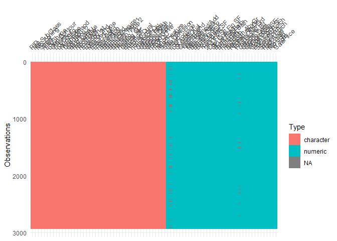<!-- -->

``` r
vis_miss(data)
```

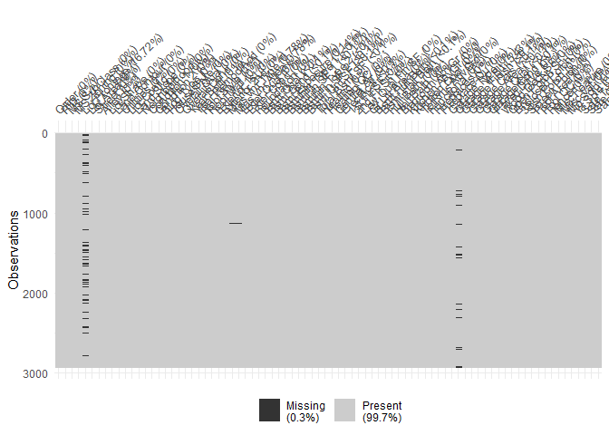<!-- -->

``` r
table(sapply(data, class))
```

    ## 
    ## character   numeric 
    ##        45        37

<br> Since several of the models we want to compare assume a normally
distributed target variable, we also check the distribution of our
target variable SalePrice:

``` r
hist(data$SalePrice, breaks="FD")
```

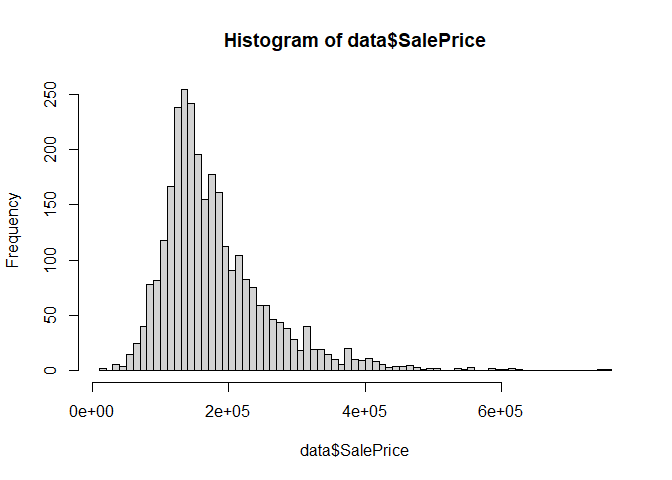<!-- -->
<br>

### Some main learnings from EDA:

1.  The column names contain whitespaces which will make referencing
    tedious.
2.  Only 37 of the features are numerical

-   of these, 4 are actually dates (years)
-   of these, 1 is an observation identifier
-   most, if not all of these have different scales

3.  The proportion of missing values in the dataset is very low (0.3%)
4.  The target variable (SalePrice) is not normally distributed

<br>

## 2. Data Preprocessing

Based on what we learned during EDA, we preprocess the data to
facilitate later modelling. We first remove whitespaces from column
names for easier referencing throughout:

``` r
names(data)<-make.names(names(data),unique = TRUE)
head(data)
```

    ## # A tibble: 6 × 82
    ##   Order PID   MS.SubClass MS.Zoning Lot.Frontage Lot.Area Street Alley Lot.Shape
    ##   <dbl> <chr> <chr>       <chr>            <dbl>    <dbl> <chr>  <chr> <chr>    
    ## 1     1 0526… 020         RL                 141    31770 Pave   NA    IR1      
    ## 2     2 0526… 020         RH                  80    11622 Pave   NA    Reg      
    ## 3     3 0526… 020         RL                  81    14267 Pave   NA    IR1      
    ## 4     4 0526… 020         RL                  93    11160 Pave   NA    Reg      
    ## 5     5 0527… 060         RL                  74    13830 Pave   NA    IR1      
    ## 6     6 0527… 060         RL                  78     9978 Pave   NA    IR1      
    ## # … with 73 more variables: Land.Contour <chr>, Utilities <chr>,
    ## #   Lot.Config <chr>, Land.Slope <chr>, Neighborhood <chr>, Condition.1 <chr>,
    ## #   Condition.2 <chr>, Bldg.Type <chr>, House.Style <chr>, Overall.Qual <dbl>,
    ## #   Overall.Cond <dbl>, Year.Built <dbl>, Year.Remod.Add <dbl>,
    ## #   Roof.Style <chr>, Roof.Matl <chr>, Exterior.1st <chr>, Exterior.2nd <chr>,
    ## #   Mas.Vnr.Type <chr>, Mas.Vnr.Area <dbl>, Exter.Qual <chr>, Exter.Cond <chr>,
    ## #   Foundation <chr>, Bsmt.Qual <chr>, Bsmt.Cond <chr>, Bsmt.Exposure <chr>, …

<br> To significantly reduce preprocessing effort and model complexity,
we start lean and just drop the categorical features. We do not
transform the date variables that are stored as numerical variables.
However, we put both these issues onto our mental list for optimization
potentials in case of poor model performance. Further, we also drop the
observation identifier column as it equals the row number:

``` r
mask = sapply(data, is.numeric)
data_red = data[mask]
data_red = data_red[c(-1)]
```

<br> While there are not many missing values, it does not take much
effort to add in column means:

``` r
data_red = na_mean(data_red)
```

<br> However, what may indeed have a significant effect on several of
the compared models is multicollinearity between predictor variables:

``` r
corrplot(cor(data_red))
```

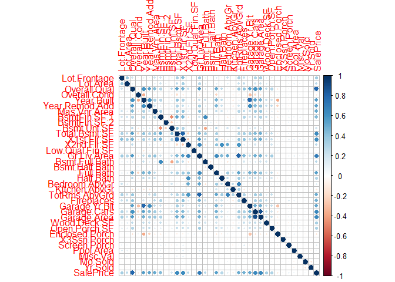<!-- -->
<br> Following common conventions, we choose 0.7 as a threshold and drop
that variable from each collinear pair which is less strongly correlated
with our target variable SalePrice (done in Excel). To further reduce
model complexity, we also drop the ‘Total’ variables as these can be
expected to be linear combinations of other variables. This renders us
with a new correlation plot indicating collinearity has been mitigated:

``` r
# cor(data_red)
drops = c("1st.Flr.SF","TotRms.AbvGrd", "Garage.Area", "Garage.Yr.Blt", "Total.Bsmt.SF")
data_red = data_red[ , !(names(data_red) %in% drops)]
corrplot(cor(data_red))
```

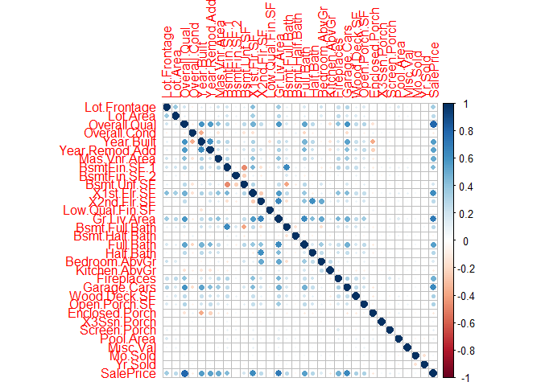<!-- -->
<br> Further, since we have spotted during EDA that our target variable
SalePrice is not normally distributed, we log transform it.

``` r
data_red$SalePrice = log(data_red$SalePrice)
hist(data_red$SalePrice, breaks="FD")
```

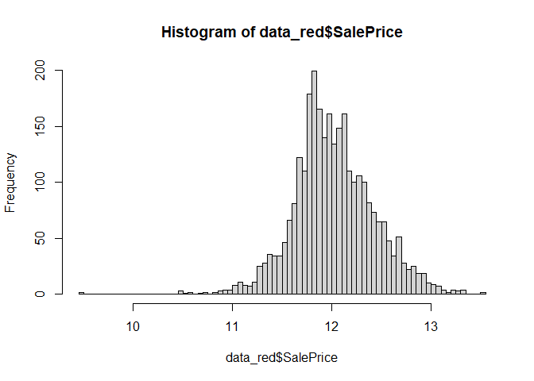<!-- -->
<br> <br> We also normalize the scales since EDA has shown that they
differ across variables:

``` r
data_red_scaled = scale(data_red)
data_red_scaled = as.data.frame(data_red_scaled)
```

<br>

## 3. Dataset Split into Training and Test Subsets

We use 70% of the data as training data, 30% as test data.

``` r
set.seed(123)
n = dim(data_red_scaled)[1]
test = sample(n, round(n*0.3))
data_red_scaled_train = data_red_scaled[-test,]
data_red_scaled_test = data_red_scaled[test,]
```

<br>

## 4. Model Training and Comparison

For prediction, we implement a variety of models and analyze their
respective performance (MSE).

We will compare the following models:

-   4.1. linear regression
-   4.2. LASSO regression
-   4.3. regression tree
-   4.4. artificial neural network

### 4.1. Linear Regression Model

We start with the linear regression model, training it on the training
data.

``` r
model_linreg = lm(SalePrice ~ ., data_red_scaled_train)
summary(model_linreg)
```

    ## 
    ## Call:
    ## lm(formula = SalePrice ~ ., data = data_red_scaled_train)
    ## 
    ## Residuals:
    ##     Min      1Q  Median      3Q     Max 
    ## -5.2966 -0.1681  0.0027  0.1969  1.4874 
    ## 
    ## Coefficients: (1 not defined because of singularities)
    ##                   Estimate Std. Error t value Pr(>|t|)    
    ## (Intercept)     -0.0013481  0.0082793  -0.163 0.870675    
    ## Lot.Frontage     0.0188517  0.0095683   1.970 0.048950 *  
    ## Lot.Area         0.0455039  0.0105673   4.306 1.74e-05 ***
    ## Overall.Qual     0.3233810  0.0144501  22.379  < 2e-16 ***
    ## Overall.Cond     0.1488984  0.0100242  14.854  < 2e-16 ***
    ## Year.Built       0.2231330  0.0157043  14.208  < 2e-16 ***
    ## Year.Remod.Add   0.0542035  0.0124064   4.369 1.31e-05 ***
    ## Mas.Vnr.Area    -0.0017736  0.0096884  -0.183 0.854762    
    ## BsmtFin.SF.1     0.0984871  0.0185507   5.309 1.22e-07 ***
    ## BsmtFin.SF.2     0.0350308  0.0105644   3.316 0.000930 ***
    ## Bsmt.Unf.SF      0.0640245  0.0159152   4.023 5.96e-05 ***
    ## X1st.Flr.SF      0.2244229  0.0182302  12.311  < 2e-16 ***
    ## X2nd.Flr.SF      0.1897205  0.0169157  11.216  < 2e-16 ***
    ## Low.Qual.Fin.SF  0.0183242  0.0088459   2.072 0.038438 *  
    ## Gr.Liv.Area             NA         NA      NA       NA    
    ## Bsmt.Full.Bath   0.0591110  0.0120616   4.901 1.03e-06 ***
    ## Bsmt.Half.Bath  -0.0011729  0.0090287  -0.130 0.896654    
    ## Full.Bath        0.0426218  0.0137789   3.093 0.002007 ** 
    ## Half.Bath        0.0124167  0.0122961   1.010 0.312708    
    ## Bedroom.AbvGr    0.0340739  0.0111089   3.067 0.002189 ** 
    ## Kitchen.AbvGr   -0.0485156  0.0099089  -4.896 1.05e-06 ***
    ## Fireplaces       0.0723200  0.0102389   7.063 2.23e-12 ***
    ## Garage.Cars      0.1210175  0.0116438  10.393  < 2e-16 ***
    ## Wood.Deck.SF     0.0227844  0.0090522   2.517 0.011912 *  
    ## Open.Porch.SF   -0.0048709  0.0088615  -0.550 0.582608    
    ## Enclosed.Porch   0.0289902  0.0090300   3.210 0.001346 ** 
    ## X3Ssn.Porch      0.0099298  0.0082232   1.208 0.227370    
    ## Screen.Porch     0.0476989  0.0088225   5.406 7.19e-08 ***
    ## Pool.Area       -0.0287409  0.0076102  -3.777 0.000164 ***
    ## Misc.Val        -0.0486018  0.0076246  -6.374 2.27e-10 ***
    ## Mo.Sold          0.0003701  0.0084788   0.044 0.965183    
    ## Yr.Sold         -0.0223885  0.0084828  -2.639 0.008372 ** 
    ## ---
    ## Signif. codes:  0 '***' 0.001 '**' 0.01 '*' 0.05 '.' 0.1 ' ' 1
    ## 
    ## Residual standard error: 0.3742 on 2020 degrees of freedom
    ## Multiple R-squared:  0.8626, Adjusted R-squared:  0.8606 
    ## F-statistic: 422.9 on 30 and 2020 DF,  p-value: < 2.2e-16

<br> As already indicated in the model summary, there seems to be a
problem: the NA indicates there are still collineated predictors:

``` r
alias(model_linreg)
```

    ## Model :
    ## SalePrice ~ Lot.Frontage + Lot.Area + Overall.Qual + Overall.Cond + 
    ##     Year.Built + Year.Remod.Add + Mas.Vnr.Area + BsmtFin.SF.1 + 
    ##     BsmtFin.SF.2 + Bsmt.Unf.SF + X1st.Flr.SF + X2nd.Flr.SF + 
    ##     Low.Qual.Fin.SF + Gr.Liv.Area + Bsmt.Full.Bath + Bsmt.Half.Bath + 
    ##     Full.Bath + Half.Bath + Bedroom.AbvGr + Kitchen.AbvGr + Fireplaces + 
    ##     Garage.Cars + Wood.Deck.SF + Open.Porch.SF + Enclosed.Porch + 
    ##     X3Ssn.Porch + Screen.Porch + Pool.Area + Misc.Val + Mo.Sold + 
    ##     Yr.Sold
    ## 
    ## Complete :
    ##             (Intercept)   Lot.Frontage  Lot.Area      Overall.Qual 
    ## Gr.Liv.Area             0             0             0             0
    ##             Overall.Cond  Year.Built    Year.Remod.Add Mas.Vnr.Area 
    ## Gr.Liv.Area             0             0             0              0
    ##             BsmtFin.SF.1  BsmtFin.SF.2  Bsmt.Unf.SF   X1st.Flr.SF  
    ## Gr.Liv.Area             0             0             0   24272/31309
    ##             X2nd.Flr.SF   Low.Qual.Fin.SF Bsmt.Full.Bath Bsmt.Half.Bath
    ## Gr.Liv.Area 498093/587752  44429/484971               0              0 
    ##             Full.Bath     Half.Bath     Bedroom.AbvGr Kitchen.AbvGr
    ## Gr.Liv.Area             0             0             0             0
    ##             Fireplaces    Garage.Cars   Wood.Deck.SF  Open.Porch.SF
    ## Gr.Liv.Area             0             0             0             0
    ##             Enclosed.Porch X3Ssn.Porch   Screen.Porch  Pool.Area    
    ## Gr.Liv.Area             0              0             0             0
    ##             Misc.Val      Mo.Sold       Yr.Sold      
    ## Gr.Liv.Area             0             0             0

<br> This suggests the threshold we have set in our earlier
multicollinearity check (0.7) was not strict enough. We thus retrain the
linear regression model, this time excluding the affected variables:

``` r
model_linreg = lm(SalePrice ~ . -X1st.Flr.SF -X2nd.Flr.SF -Low.Qual.Fin.SF,
                  data_red_scaled_train)
```

<br> The variance inflation factors in the retrained model look fine:

``` r
vif(model_linreg)
```

    ##   Lot.Frontage       Lot.Area   Overall.Qual   Overall.Cond     Year.Built 
    ##       1.372548       1.319923       3.060177       1.490288       3.595444 
    ## Year.Remod.Add   Mas.Vnr.Area   BsmtFin.SF.1   BsmtFin.SF.2    Bsmt.Unf.SF 
    ##       2.239718       1.366720       3.536537       1.346428       2.511056 
    ##    Gr.Liv.Area Bsmt.Full.Bath Bsmt.Half.Bath      Full.Bath      Half.Bath 
    ##       4.804877       2.134423       1.169225       2.746733       1.784267 
    ##  Bedroom.AbvGr  Kitchen.AbvGr     Fireplaces    Garage.Cars   Wood.Deck.SF 
    ##       1.786929       1.241742       1.507608       1.955947       1.205035 
    ##  Open.Porch.SF Enclosed.Porch    X3Ssn.Porch   Screen.Porch      Pool.Area 
    ##       1.210907       1.242562       1.016966       1.074817       1.101349 
    ##       Misc.Val        Mo.Sold        Yr.Sold 
    ##       1.063729       1.048281       1.052628

<br> The retrained model is summarized as follows:

``` r
summary(model_linreg)
```

    ## 
    ## Call:
    ## lm(formula = SalePrice ~ . - X1st.Flr.SF - X2nd.Flr.SF - Low.Qual.Fin.SF, 
    ##     data = data_red_scaled_train)
    ## 
    ## Residuals:
    ##     Min      1Q  Median      3Q     Max 
    ## -5.3918 -0.1653  0.0001  0.1956  1.4914 
    ## 
    ## Coefficients:
    ##                  Estimate Std. Error t value Pr(>|t|)    
    ## (Intercept)    -0.0009942  0.0082911  -0.120 0.904567    
    ## Lot.Frontage    0.0227897  0.0094846   2.403 0.016359 *  
    ## Lot.Area        0.0482431  0.0105387   4.578 4.99e-06 ***
    ## Overall.Qual    0.3213651  0.0144265  22.276  < 2e-16 ***
    ## Overall.Cond    0.1487724  0.0100214  14.845  < 2e-16 ***
    ## Year.Built      0.2278453  0.0156393  14.569  < 2e-16 ***
    ## Year.Remod.Add  0.0535000  0.0124111   4.311 1.71e-05 ***
    ## Mas.Vnr.Area    0.0001350  0.0096753   0.014 0.988873    
    ## BsmtFin.SF.1    0.1277577  0.0155557   8.213 3.80e-16 ***
    ## BsmtFin.SF.2    0.0468946  0.0097444   4.812 1.60e-06 ***
    ## Bsmt.Unf.SF     0.0905869  0.0129686   6.985 3.85e-12 ***
    ## Gr.Liv.Area     0.2454150  0.0179336  13.685  < 2e-16 ***
    ## Bsmt.Full.Bath  0.0571999  0.0120627   4.742 2.27e-06 ***
    ## Bsmt.Half.Bath -0.0016043  0.0090417  -0.177 0.859184    
    ## Full.Bath       0.0385306  0.0136939   2.814 0.004945 ** 
    ## Half.Bath      -0.0011911  0.0112257  -0.106 0.915510    
    ## Bedroom.AbvGr   0.0289411  0.0109641   2.640 0.008363 ** 
    ## Kitchen.AbvGr  -0.0434332  0.0097661  -4.447 9.17e-06 ***
    ## Fireplaces      0.0761292  0.0101694   7.486 1.05e-13 ***
    ## Garage.Cars     0.1225889  0.0116334  10.538  < 2e-16 ***
    ## Wood.Deck.SF    0.0225574  0.0090659   2.488 0.012921 *  
    ## Open.Porch.SF  -0.0054511  0.0088650  -0.615 0.538690    
    ## Enclosed.Porch  0.0278365  0.0090242   3.085 0.002066 ** 
    ## X3Ssn.Porch     0.0102152  0.0082356   1.240 0.214985    
    ## Screen.Porch    0.0484041  0.0088325   5.480 4.78e-08 ***
    ## Pool.Area      -0.0288773  0.0076219  -3.789 0.000156 ***
    ## Misc.Val       -0.0475709  0.0076279  -6.236 5.44e-10 ***
    ## Mo.Sold         0.0011899  0.0084856   0.140 0.888496    
    ## Yr.Sold        -0.0223377  0.0084898  -2.631 0.008575 ** 
    ## ---
    ## Signif. codes:  0 '***' 0.001 '**' 0.01 '*' 0.05 '.' 0.1 ' ' 1
    ## 
    ## Residual standard error: 0.3748 on 2022 degrees of freedom
    ## Multiple R-squared:  0.8621, Adjusted R-squared:  0.8602 
    ## F-statistic: 451.3 on 28 and 2022 DF,  p-value: < 2.2e-16

<br>

### 4.2. LASSO Regression Model

We now turn to implementing the LASSO regression model. For that, we
first have to transform our data into a form that the GLMNET package can
process. To facilitate later model comparability, we exclude the same
variables which we have excluded in the linear regression model (we will
also do this for the other models).

``` r
data_red_scaled_train_x = model.matrix(SalePrice ~ . -X1st.Flr.SF -X2nd.Flr.SF -Low.Qual.Fin.SF,
                 data_red_scaled_train)[,-1]
data_red_scaled_test_x = model.matrix(SalePrice ~ . -X1st.Flr.SF -X2nd.Flr.SF -Low.Qual.Fin.SF,
                 data_red_scaled_test)[,-1]
```

<br> LASSO penalizes large regression coefficients, up to the point of
cancelling the influence of some predictor variables completeley.
Penalty size is controlled by the parameter lambda. We first optimize
lambda via a 10-fold cross validation:

``` r
cv_model_lasso = cv.glmnet(data_red_scaled_train_x, data_red_scaled_train$SalePrice, alpha=1)
plot(cv_model_lasso)
```

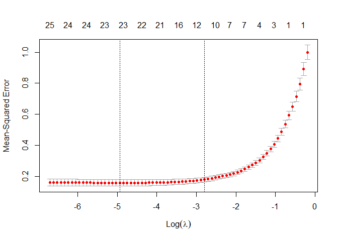<!-- -->

``` r
lambda_opt = cv_model_lasso$lambda.min
```

<br> We can now feed the lambda value minimizing MSE over the inspected
intervall (lambda_opt) into model training:

``` r
model_lasso = glmnet(data_red_scaled_train_x, data_red_scaled_train$SalePrice, alpha=1, lambda=lambda_opt)
```

<br>

### 4.3. Regression Tree Model

We now move on to implementing the regression tree model.

``` r
model_tree = tree(SalePrice ~ . -X1st.Flr.SF -X2nd.Flr.SF -Low.Qual.Fin.SF,
                  data_red_scaled_train)
summary(model_tree)
```

    ## 
    ## Regression tree:
    ## tree(formula = SalePrice ~ . - X1st.Flr.SF - X2nd.Flr.SF - Low.Qual.Fin.SF, 
    ##     data = data_red_scaled_train)
    ## Variables actually used in tree construction:
    ## [1] "Overall.Qual" "Garage.Cars"  "Gr.Liv.Area" 
    ## Number of terminal nodes:  10 
    ## Residual mean deviance:  0.2566 = 523.8 / 2041 
    ## Distribution of residuals:
    ##     Min.  1st Qu.   Median     Mean  3rd Qu.     Max. 
    ## -2.80400 -0.28120  0.02474  0.00000  0.30650  2.33000

``` r
plot(model_tree)
text(model_tree)
```

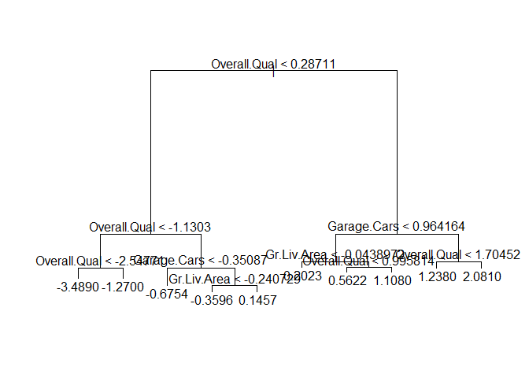<!-- -->
<br> We can also check whether pruning our tree would result in improved
prediction quality. However, this does not seem to be the case:

``` r
cv_model_tree = cv.tree(model_tree)
plot(cv_model_tree$size, cv_model_tree$dev, type="b")
```

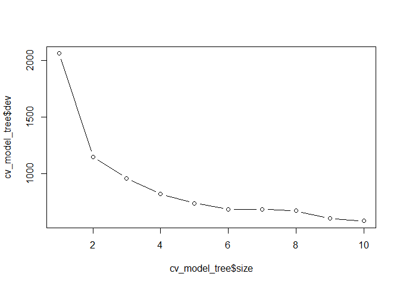<!-- -->

<br>

### 4.4. Artifical Neural Network Model

Finally, we implement the most time-intensive model to train: a simple
artifical neural network. While the model failed to converge initially,
increasing the number of repetitions (aka ‘epochs’) and the threshold,
reducing the number of hidden layers, and setting a step maximum
resolved the problem.

``` r
model_ANN = neuralnet(SalePrice ~ . -X1st.Flr.SF -X2nd.Flr.SF -Low.Qual.Fin.SF,
                      data=data_red_scaled_train, hidden=c(6, 3),
                      linear.output=TRUE, lifesign='full', rep=3, stepmax=30000,
                      threshold=0.3)
```

    ## hidden: 6, 3    thresh: 0.3    rep: 1/3    steps:    1000    min thresh: 1.36306725134077
    ##                                                      2000    min thresh: 0.772634488375646
    ##                                                      3000    min thresh: 0.460583836619512
    ##                                                      4000    min thresh: 0.382525926685291
    ##                                                      5000    min thresh: 0.302423743544616
    ##                                                      5008    error: 62.0886  time: 17.72 secs
    ## hidden: 6, 3    thresh: 0.3    rep: 2/3    steps:    1000    min thresh: 1.55070588466642
    ##                                                      2000    min thresh: 0.580276528537757
    ##                                                      3000    min thresh: 0.391867417216015
    ##                                                      4000    min thresh: 0.345622213956012
    ##                                                      5000    min thresh: 0.345622213956012
    ##                                                      6000    min thresh: 0.345622213956012
    ##                                                      7000    min thresh: 0.345622213956012
    ##                                                      8000    min thresh: 0.345622213956012
    ##                                                      9000    min thresh: 0.345622213956012
    ##                                                     10000    min thresh: 0.345622213956012
    ##                                                     11000    min thresh: 0.345622213956012
    ##                                                     12000    min thresh: 0.338015030565988
    ##                                                     12788    error: 67.35681 time: 42.11 secs
    ## hidden: 6, 3    thresh: 0.3    rep: 3/3    steps:    1000    min thresh: 1.14965955935494
    ##                                                      2000    min thresh: 0.689656370486307
    ##                                                      3000    min thresh: 0.53893689223441
    ##                                                      4000    min thresh: 0.53893689223441
    ##                                                      5000    min thresh: 0.53893689223441
    ##                                                      6000    min thresh: 0.407814353610246
    ##                                                      7000    min thresh: 0.360704204735835
    ##                                                      8000    min thresh: 0.360704204735835
    ##                                                      9000    min thresh: 0.360704204735835
    ##                                                     10000    min thresh: 0.360704204735835
    ##                                                     11000    min thresh: 0.360704204735835
    ##                                                     11650    error: 58.80357 time: 37.28 secs

<br> The best resulting neural network model look as follows:

``` r
plot(model_ANN, rep="best")
```

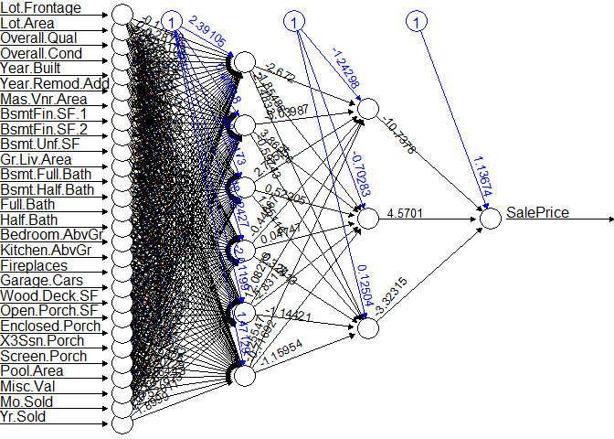<!-- -->

### Model Comparison

Now that we have trained all four models, we can compute and compare
their MSEs on the test data. (It should be noted that the prior
rescaling of the features, while not harming model comparison, prevents
meaningful MSE interpretation.)

Code for computing model MSEs:

``` r
# linear reg evaluation
preds = predict(model_linreg, data_red_scaled_test)
model_linreg_MSE = mean((data_red_scaled_test$SalePrice - preds)^2)

# LASSO reg evaluation
preds = predict(model_lasso, s=lambda_opt, data_red_scaled_test_x)
model_lasso_MSE = mean((data_red_scaled_test$SalePrice - preds)^2)

# tree evaluation
preds = predict(model_tree, data_red_scaled_test)
model_tree_MSE = mean((data_red_scaled_test$SalePrice - preds)^2)

# ANN evaluation
preds = predict(model_ANN, data_red_scaled_test)
model_ANN_MSE = mean((data_red_scaled_test$SalePrice - preds)^2)

MSEs = c(model_linreg_MSE, model_lasso_MSE, model_tree_MSE, model_ANN_MSE)
```

Plotting MSEs:

``` r
barplot(MSEs, main="MSE comparison", names.arg=c("Linear Regression", "LASSO",
                                                 "Regression Tree",
                                                 "Neural Net"))
```

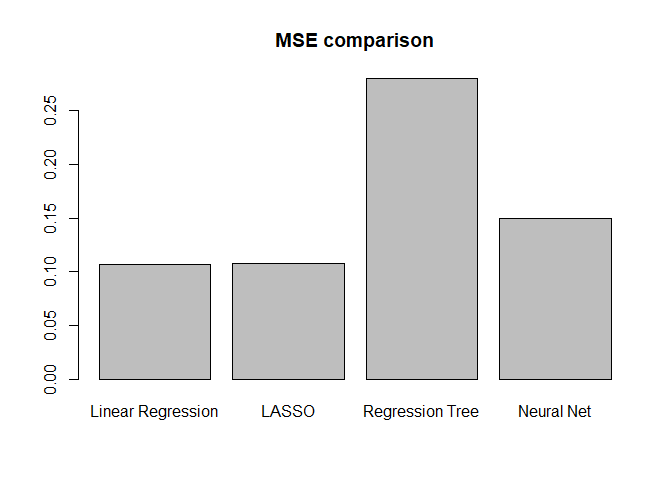<!-- -->

<br>

## 5. Model Recommendation

Finally, we make a recommendation about the preferred model. We
recommend to use the linear regression model for the prediction of
housing sales prices in Ames, IA, for three main reasons:

1.  It produces the lowest MSE of all compared models.
2.  It is easier to explain to decision-makers than most to all other
    compared models.
3.  It is easier to retrain than most to all compared models when new
    data becomes available.

However, it is clear that this model choice can only be considered
preliminary for at least three main reasons:

1.  The MSE difference of linear regression to the next best model is
    marginal. Since some randomness is involved in model computation
    (e.g. initialization of weights in the neural net model), a larger
    number of training runs might lead to convergences on different
    MSEs, with LinReg possibly falling behind other models.
2.  Hyperparameter tuning for all models is far from exhausted. This
    strongly suggests that the compared models’ MSEs can be
    significantly improved. This might lead to selection of another
    model than the LinReg model. There is definitively a need to
    systenatically optimize all compared models, and compare the
    optimized models also based on other common regression quality
    metrics than MSE such as RMSE and MAE.
3.  Categorical variables have not been utilized to reduce data
    preprocessing efforts as well as model complexity (that the encoding
    of categorical variables would have introduced). More broadly
    speaking, there is potential in optimizing preprocessing steps
    (e.g., trying different imputation methods). This, again, might have
    different implications for model selection.

### Next Steps:

In optimization, a step that could make sense to prioritize (next to
grid searching optimal hyperparameters) is to explore the predictive
power of the not-yet-included categorical variables. As the encoding
that is required for using these variables as predictors in several of
the comapred models will significantly drive dimensionality,
accompanying this with dimensionality reduction techniques such as PCA
is advisable.

<br> <br> <br>
